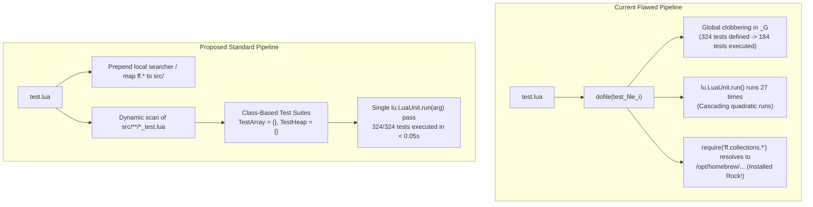

# LuaUnit Testing Standards & Architecture in `ff-lua`

This document provides a comprehensive technical audit of test practices, test suite architecture, and test execution infrastructure in [`ff-lua`](file:///Users/felipeflores/Projects/ffdev/ff-lua), with primary emphasis on [`src/collections`](file:///Users/felipeflores/Projects/ffdev/ff-lua/src/collections). It identifies structural anti-patterns in existing tests, diagnoses execution anomalies, details solutions for test isolation and module resolution, and establishes canonical testing standards for the repository.

---

## 1. Executive Summary & Audit Findings

The `ff-lua` repository currently defines **26 test files** covering data structures, functional utilities, iterators, math functions, and sorting/searching algorithms.

A deep investigation into the test runner ([`test.lua`](file:///Users/felipeflores/Projects/ffdev/ff-lua/test.lua)), test files, and package specifications revealed several critical flaws:

| Category | Observed Symptom | Underlying Cause | Impact |
| :--- | :--- | :--- | :--- |
| **Namespace Isolation** | 324 test functions defined in source, but only 184 tests reported by runner | Global function declarations (`function TestX()`) overwrite each other in `_G` | **140 tests (>43%) are silently lost** and never executed in the suite |
| **Test Execution** | Output contains 27 repeated `Ran X tests... OK` summaries | Each test file calls `os.exit(lu.LuaUnit.run())`; `dofile()` triggers LuaUnit on every file | **Cascading execution** (~3,000 redundant function calls) |
| **Dependency Drift** | Modifying [`array.lua`](file:///Users/felipeflores/Projects/ffdev/ff-lua/src/collections/array.lua) does not affect dependent collection tests | `require("ff.collections.array")` resolves to `/opt/homebrew/...` or `~/.luarocks/...` | Tests validate **globally installed rocks** instead of local working tree |
| **Assertion Style** | Failure messages report `expected: <actual>, actual: <expected>` | Tests use `assertEquals(expected, actual)` while LuaUnit default is `(actual, expected)` | Inverted error diagnostics hinder debugging |
| **Standalone Runs** | `lua src/collections/array_test.lua` crashes with `module 'array' not found` | Test files lack self-contained path initialization | Individual test files cannot be run in isolation |
| **Coverage Gaps** | [`src/aoc/matrix.lua`](file:///Users/felipeflores/Projects/ffdev/ff-lua/src/aoc/matrix.lua) and [`src/graph/graph.lua`](file:///Users/felipeflores/Projects/ffdev/ff-lua/src/graph/graph.lua) have no tests | Omitted from test authoring and runner list | Zero test coverage for complex structures |



---

## 2. Deep-Dive: Critical Issues in Current Test Code

### 2.1 Global Collision & Test Clobbering (The 140-Test Loss)

In the current test codebase, test cases are declared as global functions in the global environment `_G`:

```lua
-- src/collections/array_test.lua
function TestEmpty() ... end
function TestContains() ... end
function TestConcat() ... end
function TestToString() ... end
function TestNewIndexPreventsModifications() ... end

-- src/collections/hashmap_test.lua
function TestEmpty() ... end    -- Clobbers array_test's TestEmpty!
function TestContains() ... end -- Clobbers array_test's TestContains!

-- src/collections/heap_test.lua
function TestConstructorEmpty() ... end
function TestNewIndexPreventsModifications() ... end -- Clobbers previous!
```

#### Collision Frequency Across `src/collections/`:
- `TestNewIndexPreventsModifications`: Defined identically in **10 files**.
- `TestConcat`: Defined identically in **10 files**.
- `TestToString`: Defined identically in **9 files**.
- `TestContains`: Defined identically in **9 files**.
- `TestIterator`: Defined identically in **7 files**.
- `TestEquality` / `TestEquals`: Defined identically in **10 files**.
- `TestEmptyAndClear` / `TestEmpty`: Defined identically in **10 files**.
- `TestRemove`: Defined identically in **5 files**.
- `TestConstructorEmpty`: Defined identically in **5 files**.
- `TestConstructorWithIterable`: Defined identically in **5 files**.

#### Cross-Directory Type Collision:
- [`src/func/empty_test.lua`](file:///Users/felipeflores/Projects/ffdev/ff-lua/src/func/empty_test.lua#L27) defines `TestArray = {}` (a table).
- [`src/sort/quicksort_test.lua`](file:///Users/felipeflores/Projects/ffdev/ff-lua/src/sort/quicksort_test.lua#L6) defines `function TestArray()` (a function).
- [`src/sort/bucketsort_test.lua`](file:///Users/felipeflores/Projects/ffdev/ff-lua/src/sort/bucketsort_test.lua#L5) defines `function TestArray()` (a function).

When `empty_test.lua` runs after `quicksort_test.lua`, `TestArray` is transformed from a function to a table. When `bucketsort_test.lua` runs, it overwrites the table with another function.

**Direct Result**: Out of **324** test functions authored in the repository, only **184** exist in `_G` when the final runner executes. **140 tests are never validated in the final test suite run**.

---

### 2.2 Cascading 27-Pass Test Execution

In [`test.lua`](file:///Users/felipeflores/Projects/ffdev/ff-lua/test.lua#L54-L62):

```lua
local real_exit = os.exit
os.exit = function() end

for _, file in ipairs(test_files) do
    dofile(file)
end

os.exit = real_exit
os.exit(lu.LuaUnit.run())
```

At the bottom of all 26 test files lives:
```lua
os.exit(lu.LuaUnit.run())
```

When `dofile(file)` executes:
1. The test functions in `file` are injected into `_G`.
2. `lu.LuaUnit.run()` inside `file` is triggered.
3. LuaUnit inspects `_G` and runs **all** tests registered up to that point.
4. `os.exit` is a no-op, so execution continues to the next file.
5. File 1 runs 7 tests. File 2 runs 26 tests (7 + 19). File 3 runs 35 tests. File 26 runs 184 tests.
6. Finally, line 62 runs `os.exit(lu.LuaUnit.run())`, running all 184 tests a **27th time**.

Total test executions per `make test`: **3,212 test function invocations** instead of 324.

---

### 2.3 Installed-Rock Drift vs Local Source Tree

Internal collection modules require dependencies using the rock namespace:
- [`src/collections/heap.lua`](file:///Users/felipeflores/Projects/ffdev/ff-lua/src/collections/heap.lua#L1): `local Array = require("ff.collections.array")`
- [`src/collections/radixtree.lua`](file:///Users/felipeflores/Projects/ffdev/ff-lua/src/collections/radixtree.lua#L1): `local Array = require("ff.collections.array")`
- [`src/collections/treemap.lua`](file:///Users/felipeflores/Projects/ffdev/ff-lua/src/collections/treemap.lua#L1): `local Comparator = require("ff.func.comparator")`

In [`test.lua`](file:///Users/felipeflores/Projects/ffdev/ff-lua/test.lua#L22):
```lua
package.path = "src/?.lua;src/aoc/?.lua;src/cache/?.lua;src/collections/?.lua;src/func/?.lua;src/graph/?.lua;src/iter/?.lua;src/math/?.lua;src/search/?.lua;src/sort/?.lua;src/test/?.lua;"
    .. package.path
```

Notice that `test.lua` does **not** map `ff/collections/?.lua` to `src/collections/?.lua`.

Checking module resolution in Lua:
```lua
package.searchpath('ff.collections.array', package.path)
--> /opt/homebrew/share/lua/5.5/ff/collections/array.lua
```

**Consequence**: If a developer changes `src/collections/array.lua`, running `make test` will test `Heap`, `RadixTree`, `Stack`, `Quicksort`, and `BinarySearch` against the **installed system rock version** of `Array`, completely ignoring local source edits.

---

### 2.4 Inverted Assertion Arguments & Diagnostics

LuaUnit asserts follow the xUnit standard where the first argument is `actual` and the second is `expected` (`lu.ORDER_ACTUAL_EXPECTED = true`).

```lua
-- LuaUnit definition
lu.assertEquals(actual, expected, [extra_msg])
```

If an assertion fails:
```lua
lu.assertEquals(1, 2)
--> LuaUnit test FAILURE: expected: 2, actual: 1
```

In `src/collections/*_test.lua`, assertions are largely written backwards:
```lua
-- src/collections/array_test.lua:6
lu.assertEquals(0, #a)           -- passes (expected, actual)
lu.assertEquals(10, a:get(1))    -- passes (expected, actual)

-- src/collections/hashmap_test.lua:185
lu.assertEquals(tostring(map), "{ key = value }") -- passes (actual, expected)
```

When `#a` is 1 instead of 0, LuaUnit outputs:
`expected: 1, actual: 0`
This inverts developer expectations during regression triage.

---

### 2.5 Non-Idiomatic Assertions & Missed LuaUnit Features

1. **`assertTrue(a == b)` instead of `assertEquals(a, b)`**:
   ```lua
   -- Current (array_test.lua:100)
   lu.assertTrue(a1 == a2)
   -- Failure output: expected: true, actual: false (no context!)

   -- Recommended
   lu.assertEquals(a1, a2)
   -- Failure output: expected: [ 1, 2, 4 ], actual: [ 1, 2, 3 ] (rich object diff!)
   ```

2. **Manual Key Sorting vs `assertItemsEquals`**:
   In `hashmap_test.lua`:
   ```lua
   -- Current: 15 lines of manual table extraction and sorting
   local res = {}
   for k, v in pairs(map) do res[#res + 1] = { key = k, value = v } end
   table.sort(res, function(a, b) return a.key < b.key end)
   lu.assertEquals({ ... }, res)

   -- Recommended: 1 line with assertItemsEquals
   lu.assertItemsEquals(actual_pairs, expected_pairs)
   ```

3. **Missing Error Message Validation**:
   `lu.assertError(fn)` verifies that an error was thrown, but ignores whether it was the *expected* error. Using `lu.assertErrorMsgContains(sub, fn, ...)` ensures that accidental syntax errors or nil-pointer dereferences are not mistaken for valid precondition guards.

---

## 3. Recommended Code Style & Architecture for Tests

### 3.1 The Class-Based Test Suite Pattern

Every test file must encapsulate its tests into a dedicated test table matching `Test<Module>` or `Test<Class>`:

```lua
local lu = require("luaunit")
local Array = require("ff.collections.array")

TestArray = {}

function TestArray:setUp()
    self.emptyArray = Array.new()
    self.sampleArray = Array.new({ 10, 20, 30 })
end

function TestArray:tearDown()
    self.emptyArray = nil
    self.sampleArray = nil
end

function TestArray:testEmpty()
    lu.assertTrue(self.emptyArray:empty())
    lu.assertFalse(self.sampleArray:empty())
end

function TestArray:testGet()
    lu.assertEquals(self.sampleArray:get(1), 10)
    lu.assertEquals(self.sampleArray:get(2), 20)
    lu.assertEquals(self.sampleArray:get(3), 30)
end
```

#### Key Architectural Benefits:
1. **Namespace Isolation**: `TestArray:testEmpty()` and `TestHashMap:testEmpty()` live in separate tables. Zero clobbering.
2. **Lifecycle Management**: `setUp()` and `tearDown()` execute before and after every test method, guaranteeing clean state.
3. **Selective CLI Execution**: Run specific suites or methods from the command line:
   ```bash
   lua test.lua TestArray
   lua test.lua TestArray.testGet
   lua test.lua -p Heap
   ```

---

### 3.2 Canonical Test Method Naming Standard

Adopt a consistent method naming format across all suites:

```text
function Test<Class>:test<Feature>[_<Condition>]()
```

- Prefix: `test` (camelCase).
- Feature: Method or property being tested (`Insert`, `Get`, `Contains`, `Concat`).
- Condition (Optional): Edge case, validation, or state (`Empty`, `OutOfBounds`, `Duplicates`, `ThrowsOnNil`).

Examples:
- `TestArray:testInsert_AtEnd()`
- `TestArray:testInsert_OutOfBoundsThrows()`
- `TestHashMap:testCompute_KeyPresent()`
- `TestHeap:testPop_EmptyReturnsNil()`

---

### 3.3 Canonical Assertion Table

Standardize assertions across the test suite:

| Goal | Recommended Assertion | Anti-Pattern to Avoid |
| :--- | :--- | :--- |
| Equality (primitives & objects) | `lu.assertEquals(actual, expected)` | `lu.assertEquals(expected, actual)`<br/>`lu.assertTrue(actual == expected)` |
| Inequality | `lu.assertNotEquals(actual, unexpected)` | `lu.assertFalse(actual == unexpected)` |
| Boolean evaluation | `lu.assertTrue(actual)` / `lu.assertFalse(actual)` | `lu.assertEquals(actual, true)` |
| Nil checks | `lu.assertNil(actual)` / `lu.assertNotNil(actual)` | `lu.assertTrue(actual == nil)` |
| Error presence | `lu.assertError(fn, ...)` | `local ok = pcall(fn); lu.assertFalse(ok)` |
| Error message guard | `lu.assertErrorMsgContains(expected_sub, fn, ...)` | Unchecked `assertError` |
| Unordered item matching | `lu.assertItemsEquals(actual_list, expected_list)` | Manual `table.sort` + `assertEquals` |
| String matching | `lu.assertStrMatches(actual, pattern)` | `lu.assertTrue(actual:match(pattern) ~= nil)` |

---

### 3.4 Canonical Test File Anatomy (10-Part Standard Companion)

Mirroring the [10-part specification for collection classes](file:///Users/felipeflores/Projects/ffdev/ff-lua/src/collections/collections.md#L32), every collection test file should follow this structure:

```lua
-----------------------------------------------------------------------------
-- 1. Upvalue caching & Imports
-----------------------------------------------------------------------------
local lu = require("luaunit")
local Array = require("ff.collections.array")

-----------------------------------------------------------------------------
-- 2. Test Suite Table Definition
-----------------------------------------------------------------------------
TestArray = {}

-----------------------------------------------------------------------------
-- 3. Suite Lifecycle Hooks (Optional)
-----------------------------------------------------------------------------
function TestArray:setUp()
    self.arr = Array.new({ 1, 2, 3 })
end

function TestArray:tearDown()
    self.arr = nil
end

-----------------------------------------------------------------------------
-- 4. Constructor & Type Guard Tests
-----------------------------------------------------------------------------
function TestArray:testIsArray()
    lu.assertTrue(Array.isArray(self.arr))
    lu.assertFalse(Array.isArray({}))
    lu.assertFalse(Array.isArray(nil))
end

function TestArray:testNew_Empty()
    local a = Array.new()
    lu.assertEquals(#a, 0)
    lu.assertTrue(a:empty())
end

-----------------------------------------------------------------------------
-- 5. Core Accessor & Inspection Tests
-----------------------------------------------------------------------------
function TestArray:testGet()
    lu.assertEquals(self.arr:get(1), 1)
    lu.assertEquals(self.arr:get(2), 2)
end

function TestArray:testGet_OutOfBoundsThrows()
    lu.assertError(function() self.arr:get(0) end)
    lu.assertError(function() self.arr:get(4) end)
end

-----------------------------------------------------------------------------
-- 6. Mutation & Modification Tests
-----------------------------------------------------------------------------
function TestArray:testInsert()
    self.arr:insert(4)
    lu.assertEquals(#self.arr, 4)
    lu.assertEquals(self.arr:get(4), 4)
end

-----------------------------------------------------------------------------
-- 7. Metamethod Tests (__len, __eq, __concat, __tostring, __newindex)
-----------------------------------------------------------------------------
function TestArray:testLen()
    lu.assertEquals(#self.arr, 3)
end

function TestArray:testEquality()
    local duplicate = Array.new({ 1, 2, 3 })
    lu.assertEquals(self.arr, duplicate)
end

function TestArray:testNewIndex_PreventsModification()
    lu.assertErrorMsgContains("cannot add new properties", function()
        self.arr.foo = "bar"
    end)
end

-----------------------------------------------------------------------------
-- 8. Standalone Execution Guard
-----------------------------------------------------------------------------
if arg and arg[0] and arg[0]:find("array_test%.lua$") then
    os.exit(lu.LuaUnit.run())
end

return TestArray
```

---

## 4. Test Infrastructure & Setup Modernization (`test.lua`)

### 4.1 Local Module Loader for `ff.*` Namespace

To prevent dependency drift and ensure local code changes are always tested, `test.lua` should register a custom searcher or pre-populate `package.preload` mapping `ff.*` directly to `src/`:

```lua
-- test.lua: Local package resolution resolver
local function map_local_ff_modules()
    local modules = {
        ["ff.aoc.matrix"]           = "src/aoc/matrix.lua",
        ["ff.cache.lru"]            = "src/cache/lru.lua",
        ["ff.collections.array"]    = "src/collections/array.lua",
        ["ff.collections.hashmap"]  = "src/collections/hashmap.lua",
        ["ff.collections.heap"]     = "src/collections/heap.lua",
        ["ff.collections.intervaltree"] = "src/collections/intervaltree.lua",
        ["ff.collections.linkedlist"]   = "src/collections/linkedlist.lua",
        ["ff.collections.queue"]    = "src/collections/queue.lua",
        ["ff.collections.radixtree"]= "src/collections/radixtree.lua",
        ["ff.collections.set"]      = "src/collections/set.lua",
        ["ff.collections.stack"]    = "src/collections/stack.lua",
        ["ff.collections.treemap"]  = "src/collections/treemap.lua",
        ["ff.func.comparator"]      = "src/func/comparator.lua",
        ["ff.empty"]                = "src/func/empty.lua",
        ["ff.head"]                 = "src/func/head.lua",
        ["ff.memoize"]              = "src/func/memoize.lua",
        ["ff.tail"]                 = "src/func/tail.lua",
        ["ff.graph"]                = "src/graph/graph.lua",
        ["ff.iter.permutations"]    = "src/iter/permutations.lua",
        ["ff.factorial"]            = "src/math/factorial.lua",
        ["ff.fibonacci"]            = "src/math/fibonacci.lua",
        ["ff.max"]                  = "src/math/max.lua",
        ["ff.min"]                  = "src/math/min.lua",
        ["ff.trunc"]                = "src/math/trunc.lua",
        ["ff.search.binarysearch"]  = "src/search/binarysearch.lua",
        ["ff.search.quickselect"]   = "src/search/quickselect.lua",
        ["ff.sort.bucketsort"]      = "src/sort/bucketsort.lua",
        ["ff.sort.quicksort"]       = "src/sort/quicksort.lua",
        ["ff.spy"]                  = "src/test/spy.lua",
    }

    for modname, path in pairs(modules) do
        package.preload[modname] = function()
            return dofile(path)
        end
    end
end
map_local_ff_modules()
```

With this mapping in place:
1. `require("ff.collections.array")` resolves to the local working directory file every time.
2. Tests are completely isolated from whatever version happens to be installed in LuaRocks.
3. Tests can run in pristine environments without requiring prior `luarocks make` or `luarocks install`.

---

### 4.2 Dynamic Test Discovery

Rather than maintaining a hardcoded list of 26 paths in `test.lua` (which risks new tests being omitted), tests can be loaded dynamically:

```lua
local test_patterns = {
    "src/cache/*_test.lua",
    "src/collections/*_test.lua",
    "src/func/*_test.lua",
    "src/iter/*_test.lua",
    "src/math/*_test.lua",
    "src/search/*_test.lua",
    "src/sort/*_test.lua",
}

-- Load all test files once to populate Test* tables
for _, pattern in ipairs(test_patterns) do
    local handle = io.popen("ls " .. pattern .. " 2>/dev/null")
    if handle then
        for file in handle:lines() do
            dofile(file)
        end
        handle:close()
    end
end
```

---

### 4.3 Clean Single-Run Execution & CLI Passthrough

Eliminate `os.exit = function() end` and execute LuaUnit once:

```lua
-- Forward command-line arguments to LuaUnit
os.exit(lu.LuaUnit.run(table.unpack(arg)))
```

This unlocks full CLI capabilities:
- `make test ARGS="-v"`: Verbose per-test reporting.
- `make test ARGS="TestHeap"`: Run only the Heap test suite.
- `make test ARGS="-p Concat"`: Run all tests with "Concat" in their name.
- `make test ARGS="-o junit -n results.xml"`: Generate JUnit XML reports for CI.

---

## 5. LuaRocks & Packaging Recommendations

### 5.1 Decouple Test Utilities from Production Modules

In [`ff-lua-0.25.0-1.rockspec`](file:///Users/felipeflores/Projects/ffdev/ff-lua/ff-lua-0.25.0-1.rockspec#L63):
```lua
modules = {
    ...
    ["ff.spy"] = "src/test/spy.lua",
}
```

`spy.lua` is a test spy helper intended for mocking in tests (e.g. [`memoize_test.lua`](file:///Users/felipeflores/Projects/ffdev/ff-lua/src/func/memoize_test.lua#L2)). Exporting it as a public library module `ff.spy` in the production rockspec leaks internal test scaffolding into the user-facing package API.

**Recommendation**:
- Move test utilities to a non-exported path (e.g. `test/spy.lua` or keep local in `src/test/`).
- Remove `["ff.spy"]` from the rockspec `build.modules` table.

---

### 5.2 Harmonize Rockspec Module Naming

The current rockspec displays inconsistent namespace nesting:

| Module File | Current Rockspec Key | Recommended Consistent Key |
| :--- | :--- | :--- |
| `src/func/comparator.lua` | `ff.func.comparator` | `ff.func.comparator` (Kept) |
| `src/func/empty.lua` | `ff.empty` | `ff.func.empty` (Align with directory) |
| `src/func/head.lua` | `ff.head` | `ff.func.head` |
| `src/func/tail.lua` | `ff.tail` | `ff.func.tail` |
| `src/func/memoize.lua` | `ff.memoize` | `ff.func.memoize` |
| `src/math/factorial.lua` | `ff.factorial` | `ff.math.factorial` |
| `src/math/fibonacci.lua` | `ff.fibonacci` | `ff.math.fibonacci` |
| `src/math/max.lua` | `ff.max` | `ff.math.max` |
| `src/math/min.lua` | `ff.min` | `ff.math.min` |
| `src/math/trunc.lua` | `ff.trunc` | `ff.math.trunc` |

Harmonizing module names ensures consistency with `ff.collections.*`, `ff.search.*`, `ff.sort.*`, and `ff.iter.*`.

---

### 5.3 Modernized `Makefile` Test Targets

Update [`Makefile`](file:///Users/felipeflores/Projects/ffdev/ff-lua/Makefile) to support development flags:

```makefile
.PHONY: test
test:
	lua test.lua $(ARGS)

.PHONY: test-luarocks
test-luarocks:
	luarocks test -- $(ARGS)
```

Usage:
```bash
make test ARGS="-v"
make test ARGS="TestArray"
make test ARGS="-p Equality"
```

---

## 6. Migration Roadmap

To transition the repository to these standards without breaking existing workflows:

2. **Phase 2: Migrate `src/collections/*_test.lua` to Test Classes**:
   - Wrap test functions in `Test<Name> = {}` tables.
   - Fix assertion ordering to `lu.assertEquals(actual, expected)`.
   - Replace `assertTrue(a == b)` with `lu.assertEquals(a, b)`.
   - Restore all 140 lost tests to active execution.
3. **Phase 3: Add Missing Suites**:
   - Implement `src/aoc/matrix_test.lua` for `Matrix`.
   - Implement `src/graph/graph_test.lua` for `Graph`.
4. **Phase 4: Harmonize Rockspec & Makefile**:
   - Update Makefile with `ARGS` passthrough.
   - Clean up rockspec module names and remove `ff.spy` export.
